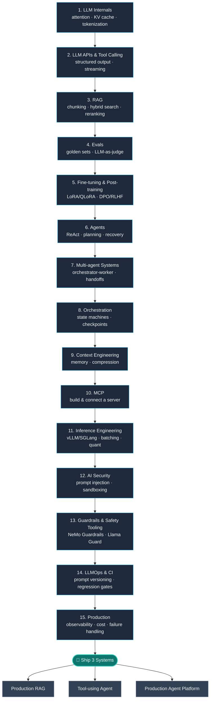

# Production AI Engineering Roadmap

🚀 Zero → AI Engineer Roadmap (2026)

Assumes basic ML/DL.

Goal: Learn to build and ship production LLM + agent systems.

## Table of Contents

- [1. LLM Internals](#1-llm-internals)
- [2. LLM APIs + Tool Calling](#2-llm-apis--tool-calling)
- [3. RAG](#3-rag)
- [4. Evals](#4-evals)
- [5. Fine-tuning & Post-training](#5-fine-tuning--post-training)
- [6. Agents](#6-agents)
- [7. Multi-agent Systems](#7-multi-agent-systems)
- [8. Orchestration](#8-orchestration)
- [9. Context Engineering](#9-context-engineering)
- [10. MCP](#10-mcp)
- [11. Inference Engineering](#11-inference-engineering)
- [12. AI Security](#12-ai-security)
- [13. Guardrails & Safety Tooling](#13-guardrails--safety-tooling)
- [14. LLMOps & CI for LLM Apps](#14-llmops--ci-for-llm-apps)
- [15. Production](#15-production)
- [Build 3 Projects](#build-3-projects)
- [Contributing](#contributing)
- [License](#license)

## How to use this roadmap

- Go **in order** — each stage assumes the previous one. Don't skip to agents before you understand RAG and evals.
- **Time-box each stage** (roughly 1–2 weeks) and don't move on until you've shipped the "Build" item, not just read the resource.
- **Build > read.** A roadmap without a working repo attached to it is just a reading list.
- Track your progress with the checklist below — fork this repo and check off stages as you complete them.

### Progress checklist

- [ ] 1. LLM Internals
- [ ] 2. LLM APIs + Tool Calling
- [ ] 3. RAG
- [ ] 4. Evals
- [ ] 5. Fine-tuning & Post-training
- [ ] 6. Agents
- [ ] 7. Multi-agent Systems
- [ ] 8. Orchestration
- [ ] 9. Context Engineering
- [ ] 10. MCP
- [ ] 11. Inference Engineering
- [ ] 12. AI Security
- [ ] 13. Guardrails & Safety Tooling
- [ ] 14. LLMOps & CI for LLM Apps
- [ ] 15. Production
- [ ] Project 1 — Production RAG
- [ ] Project 2 — Tool-using agent
- [ ] Project 3 — Production agent platform

## 1. LLM Internals

Resources:
- [Karpathy — Neural Networks: Zero to Hero](https://karpathy.ai/zero-to-hero.html)
- [Jay Alammar — The Illustrated Transformer](https://jalammar.github.io/illustrated-transformer/)

Build:
- Implement a small GPT from scratch
- Understand attention, KV cache, tokenization, sampling

## 2. LLM APIs + Tool Calling

Resources:
- [Anthropic — Prompt Engineering Guide](https://docs.anthropic.com/en/docs/build-with-claude/prompt-engineering/overview)
- [Anthropic API docs](https://docs.anthropic.com/) / [OpenAI API docs](https://platform.openai.com/docs)
- Medium — search ["LLM function calling"](https://medium.com/search?q=llm%20function%20calling) *(no single canonical article verified — pick a well-reviewed one)*

Learn:
- Structured outputs
- Function/tool calling
- Streaming
- Retries, rate limits, token usage
- Multimodal inputs (vision, audio) — most provider APIs now accept images/audio alongside text; the same tool-calling patterns apply

Build:
- An API-based LLM application

## 3. RAG

Resources:
- [Simon Willison — Embeddings / RAG posts](https://simonwillison.net/tags/embeddings/)
- [Pinecone — Learning Center (RAG guides)](https://www.pinecone.io/learn/)
- Medium — search ["modern RAG"](https://medium.com/search?q=modern%20rag) *(no single canonical article verified)*
- Medium — search ["reranking RAG"](https://medium.com/search?q=reranking%20rag) *(no single canonical article verified)*

Learn:
- Chunking
- Embeddings
- Hybrid search
- Reranking
- Metadata filtering
- Citations
- Query rewriting

Build:
- RAG over your own docs/PDFs

## 4. Evals

Resources:
- [Hamel Husain — AI Evals (free email course)](https://ai.hamel.dev/eval-course)
- Medium — search ["evaluating RAG pipelines"](https://medium.com/search?q=evaluating%20rag%20pipelines) *(no single canonical article verified)*

Learn:
- Golden datasets
- Retrieval metrics
- LLM-as-judge
- Regression testing
- Failure analysis

Build:
- An eval suite for your RAG system

## 5. Fine-tuning & Post-training

Resources:
- [Hugging Face — PEFT documentation (LoRA / QLoRA)](https://huggingface.co/docs/peft/)
- [Hugging Face — TRL documentation (SFT / DPO / RLHF)](https://huggingface.co/docs/trl/)

Learn:
- When to fine-tune vs. prompt/RAG (cost, latency, and data tradeoffs)
- Supervised fine-tuning (SFT)
- Parameter-efficient fine-tuning: LoRA, QLoRA
- Preference optimization: RLHF, DPO
- Distillation from a larger model into a smaller one
- Dataset curation for fine-tuning (quality > quantity)

Build:
- Fine-tune a small open-weight model on a narrow task and compare it against a prompted baseline on your eval suite

## 6. Agents

Resources:
- [Anthropic — Building Effective Agents](https://www.anthropic.com/engineering/building-effective-agents)
- [Sam Witteveen — YouTube channel](https://www.youtube.com/@samwitteveenai)
- [James Briggs — YouTube channel](https://www.youtube.com/c/jamesbriggs)
- Medium — search ["from LLMs to agents"](https://medium.com/search?q=from%20llms%20to%20agents) *(no single canonical article verified)*

Learn:
- Tool use
- ReAct
- State
- Planning
- Retries
- Failure recovery
- Human-in-the-loop

Build:
- An agent with 3–5 real tools

## 7. Multi-agent Systems

Resources:
- [Anthropic — How we built our multi-agent research system](https://www.anthropic.com/engineering/multi-agent-research-system)
- [CrewAI documentation](https://docs.crewai.com/)

Learn:
- Orchestrator/lead–worker (subagent) patterns
- Task decomposition and delegation
- Parallel vs. sequential subagent execution
- Coordination failure modes (duplicated work, context loss between agents)
- Evaluating multi-agent systems (harder than single-agent evals)

Build:
- Convert your single agent into an orchestrator that delegates to 2–3 specialized subagents

## 8. Orchestration

Resources:
- [LangGraph documentation](https://docs.langchain.com/oss/python/langgraph/overview)
- [Anthropic engineering blog](https://www.anthropic.com/engineering)

Learn:
- State machines
- Workflows vs agents
- Checkpoints
- Persistence
- Durable execution

Build:
- Convert your agent into an explicit stateful workflow

## 9. Context Engineering

Resources:
- [Anthropic — Effective Context Engineering for AI Agents](https://www.anthropic.com/engineering/effective-context-engineering-for-ai-agents)
- Medium — search ["context engineering agentic applications"](https://medium.com/search?q=context%20engineering%20agentic%20applications) *(no single canonical article verified)*

Learn:
- Context selection
- Memory
- Compression
- Progressive disclosure
- Tool descriptions
- Long-context management

Build:
- A context layer for your agent

## 10. MCP

Resources:
- [modelcontextprotocol.io](https://modelcontextprotocol.io/)
- [Anthropic — Introducing the Model Context Protocol](https://www.anthropic.com/news/model-context-protocol)
- Medium — search ["MCP foundations"](https://medium.com/search?q=mcp%20foundations) *(no single canonical article verified)*
- Medium — search ["MCP in production"](https://medium.com/search?q=mcp%20in%20production) *(no single canonical article verified)*

Build:
- One real MCP server for a tool you use
- Connect it to your agent

## 11. Inference Engineering

Resources:
- [vLLM documentation](https://docs.vllm.ai/)
- [SGLang documentation](https://docs.sglang.io/)
- [Hugging Face documentation](https://huggingface.co/docs)

Learn:
- KV cache
- Batching
- Quantization
- Streaming
- Speculative decoding
- Model routing

Measure:
- TTFT
- Tokens/sec
- p50/p95 latency
- GPU memory
- Cost/request

## 12. AI Security

Resources:
- [OWASP — GenAI Security Project / Top 10 for LLM & GenAI](https://genai.owasp.org/)
- [Google Cloud — Secure AI Framework (SAIF)](https://cloud.google.com/use-cases/secure-ai-framework)
- Medium — search ["AI agent security"](https://medium.com/search?q=ai%20agent%20security) *(no single canonical article verified)*

Learn:
- Prompt injection
- Indirect prompt injection
- Tool poisoning
- Data exfiltration
- Excessive agency
- Authorization
- Sandboxing

## 13. Guardrails & Safety Tooling

Resources:
- [NVIDIA NeMo Guardrails documentation](https://docs.nvidia.com/nemo/guardrails/)
- [Meta Llama Guard model cards](https://www.llama.com/docs/model-cards-and-prompt-formats/meta-llama-guard-2/)
- [Promptfoo — CI/CD security & eval integration](https://www.promptfoo.dev/docs/integrations/ci-cd/)

Learn:
- Input/output moderation and content classifiers
- Jailbreak and prompt-injection detection
- PII detection and redaction
- Topic/scope restriction ("stay on topic" guardrails)
- Trading off guardrail strictness against false-positive rate

Build:
- Add an input and output guardrail layer to the agent you built in stage 6/7 and measure its false-positive rate on real traffic

## 14. LLMOps & CI for LLM Apps

Resources:
- [Promptfoo documentation](https://www.promptfoo.dev/docs/intro/)
- [LangSmith — Observability & tracing docs](https://docs.langchain.com/langsmith/observability)

Learn:
- Prompt versioning and diffing
- Regression testing in CI (eval suite as a merge gate)
- Shadow deployments and canary releases for prompt/model changes
- Dataset drift detection
- Rollback strategy when a model or prompt update regresses quality

Build:
- Wire your eval suite (from stage 4) into a CI pipeline that blocks a merge on regression, and add an automated red-team/security scan (e.g. Promptfoo's built-in scanner) as a second gate

## 15. Production

Resources:
- [Promptfoo — CI/CD security & eval integration](https://www.promptfoo.dev/docs/integrations/ci-cd/)
- [LangSmith — Observability & tracing docs](https://docs.langchain.com/langsmith/observability)

Learn:
- Observability
- Tracing
- Cost tracking
- Rate limiting
- Caching
- Load testing
- Failure handling

Track:
- Quality
- Cost/request
- Latency
- Error rate
- Tool failures
- Task success rate

## Build 3 projects

1. Production RAG
2. Tool-using agent
3. Production agent platform

For every project, publish:
- Architecture
- Evaluation methodology
- Results
- Cost
- Latency
- Failure cases
- Tradeoffs

**Don't learn 10 frameworks.** Pick one stack and go deep.

**Don't build 15 toy chatbots.** Build 3 systems and measure them.

**Primary sources > AI roadmap listicles.** Medium is useful for implementation experience. Vendor docs, papers, specs, and engineering blogs should be your source of truth.

**Recommended book:** [*AI Engineering* — Chip Huyen](https://www.oreilly.com/library/view/ai-engineering/9781098166298/) ([book resources on GitHub](https://github.com/chiphuyen/aie-book))

## Contributing

This list is continuously updated. Found a broken link, a better resource, or want to add your own project write-up? PRs and issues are welcome — please make sure any link you add is tested and working before opening a PR.

## License

Released under the [MIT License](./LICENSE).

---

Maintained by [Ashish Patel](https://github.com/ashishpatel26) — follow on [LinkedIn](https://www.linkedin.com/in/ashishpatel2604/) for more AI/ML resources.
