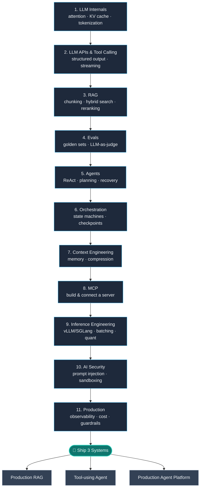

# Production AI Engineering Roadmap

🚀 Zero → AI Engineer Roadmap (2026)

Assumes basic ML/DL.

Goal: Learn to build and ship production LLM + agent systems.

## 1. LLM Internals

Resources:
- [Karpathy — Neural Networks: Zero to Hero](https://karpathy.ai/zero-to-hero.html)
- [Jay Alammar — The Illustrated Transformer](https://jalammar.github.io/illustrated-transformer/)

Build:
- Implement a small GPT from scratch
- Understand attention, KV cache, tokenization, sampling

## 2. LLM APIs + Tool Calling

Resources:
- [Anthropic — Prompt Engineering Guide](https://docs.anthropic.com/en/docs/build-with-claude/prompt-engineering/overview)
- [Anthropic API docs](https://docs.anthropic.com/) / [OpenAI API docs](https://platform.openai.com/docs)
- Medium — search ["LLM function calling"](https://medium.com/search?q=llm%20function%20calling) *(no single canonical article verified — pick a well-reviewed one)*

Learn:
- Structured outputs
- Function/tool calling
- Streaming
- Retries, rate limits, token usage

Build:
- An API-based LLM application

## 3. RAG

Resources:
- [Simon Willison — Embeddings / RAG posts](https://simonwillison.net/tags/embeddings/)
- [Pinecone — Learning Center (RAG guides)](https://www.pinecone.io/learn/)
- Medium — search ["modern RAG"](https://medium.com/search?q=modern%20rag) *(no single canonical article verified)*
- Medium — search ["reranking RAG"](https://medium.com/search?q=reranking%20rag) *(no single canonical article verified)*

Learn:
- Chunking
- Embeddings
- Hybrid search
- Reranking
- Metadata filtering
- Citations
- Query rewriting

Build:
- RAG over your own docs/PDFs

## 4. Evals

Resources:
- [Hamel Husain — AI Evals (free email course)](https://ai.hamel.dev/eval-course)
- Medium — search ["evaluating RAG pipelines"](https://medium.com/search?q=evaluating%20rag%20pipelines) *(no single canonical article verified)*

Learn:
- Golden datasets
- Retrieval metrics
- LLM-as-judge
- Regression testing
- Failure analysis

Build:
- An eval suite for your RAG system

## 5. Agents

Resources:
- [Anthropic — Building Effective Agents](https://www.anthropic.com/engineering/building-effective-agents)
- [Sam Witteveen — YouTube channel](https://www.youtube.com/@samwitteveenai)
- [James Briggs — YouTube channel](https://www.youtube.com/c/jamesbriggs)
- Medium — search ["from LLMs to agents"](https://medium.com/search?q=from%20llms%20to%20agents) *(no single canonical article verified)*

Learn:
- Tool use
- ReAct
- State
- Planning
- Retries
- Failure recovery
- Human-in-the-loop

Build:
- An agent with 3–5 real tools

## 6. Orchestration

Resources:
- [LangGraph documentation](https://docs.langchain.com/oss/python/langgraph/overview)
- [Anthropic engineering blog](https://www.anthropic.com/engineering)

Learn:
- State machines
- Workflows vs agents
- Checkpoints
- Persistence
- Durable execution

Build:
- Convert your agent into an explicit stateful workflow

## 7. Context Engineering

Resources:
- [Anthropic — Effective Context Engineering for AI Agents](https://www.anthropic.com/engineering/effective-context-engineering-for-ai-agents)
- Medium — search ["context engineering agentic applications"](https://medium.com/search?q=context%20engineering%20agentic%20applications) *(no single canonical article verified)*

Learn:
- Context selection
- Memory
- Compression
- Progressive disclosure
- Tool descriptions
- Long-context management

Build:
- A context layer for your agent

## 8. MCP

Resources:
- [modelcontextprotocol.io](https://modelcontextprotocol.io/)
- [Anthropic — Introducing the Model Context Protocol](https://www.anthropic.com/news/model-context-protocol)
- Medium — search ["MCP foundations"](https://medium.com/search?q=mcp%20foundations) *(no single canonical article verified)*
- Medium — search ["MCP in production"](https://medium.com/search?q=mcp%20in%20production) *(no single canonical article verified)*

Build:
- One real MCP server for a tool you use
- Connect it to your agent

## 9. Inference Engineering

Resources:
- [vLLM documentation](https://docs.vllm.ai/)
- [SGLang documentation](https://docs.sglang.io/)
- [Hugging Face documentation](https://huggingface.co/docs)

Learn:
- KV cache
- Batching
- Quantization
- Streaming
- Speculative decoding
- Model routing

Measure:
- TTFT
- Tokens/sec
- p50/p95 latency
- GPU memory
- Cost/request

## 10. AI Security

Resources:
- [OWASP — GenAI Security Project / Top 10 for LLM & GenAI](https://genai.owasp.org/)
- [Google Cloud — Secure AI Framework (SAIF)](https://cloud.google.com/use-cases/secure-ai-framework)
- Medium — search ["AI agent security"](https://medium.com/search?q=ai%20agent%20security) *(no single canonical article verified)*

Learn:
- Prompt injection
- Indirect prompt injection
- Tool poisoning
- Data exfiltration
- Excessive agency
- Authorization
- Sandboxing

## 11. Production

Learn:
- Observability
- Tracing
- Cost tracking
- Rate limiting
- Caching
- Load testing
- Guardrails
- Failure handling

Track:
- Quality
- Cost/request
- Latency
- Error rate
- Tool failures
- Task success rate

## Build 3 projects

1. Production RAG
2. Tool-using agent
3. Production agent platform

For every project, publish:
- Architecture
- Evaluation methodology
- Results
- Cost
- Latency
- Failure cases
- Tradeoffs

**Don't learn 10 frameworks.** Pick one stack and go deep.

**Don't build 15 toy chatbots.** Build 3 systems and measure them.

**Primary sources > AI roadmap listicles.** Medium is useful for implementation experience. Vendor docs, papers, specs, and engineering blogs should be your source of truth.

**Recommended book:** [*AI Engineering* — Chip Huyen](https://www.oreilly.com/library/view/ai-engineering/9781098166298/) ([book resources on GitHub](https://github.com/chiphuyen/aie-book))
